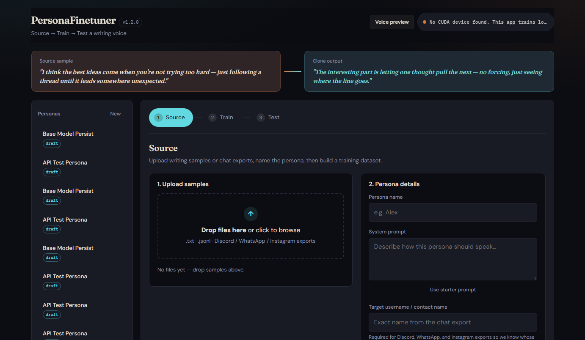
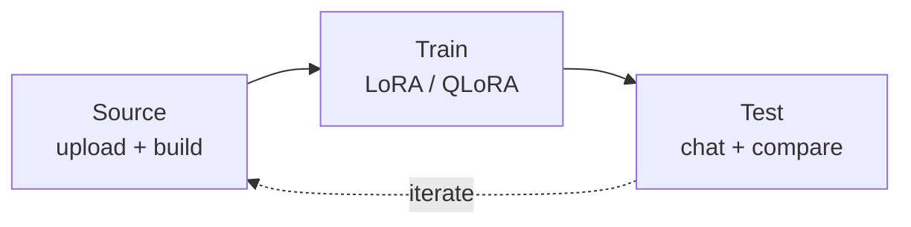
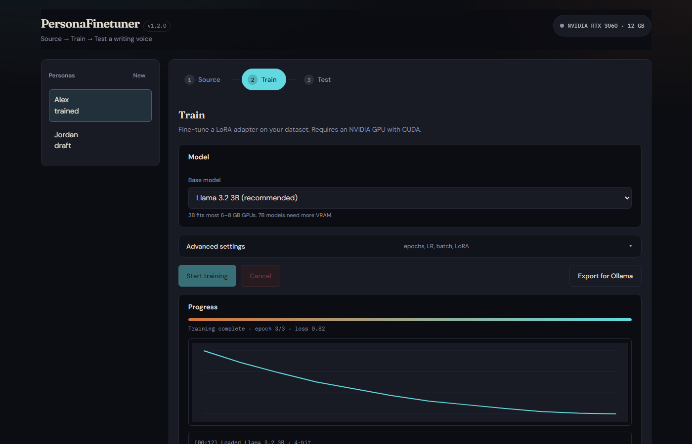
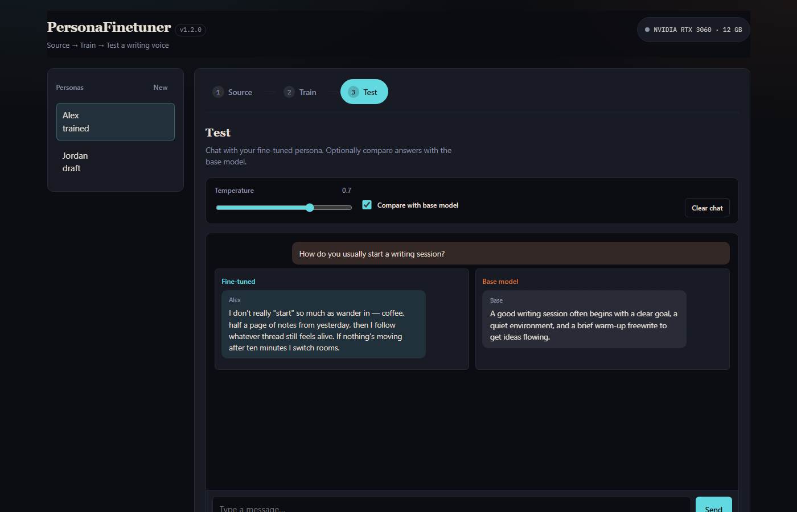

# PersonaFinetuner

[](https://github.com/ericcayers-ai/LLM-PersonaFinetuner/releases)
[](LICENSE)
[](tests/)
[](#requirements)

**Clone a writing voice locally.** Upload samples or chat exports, fine-tune a small open-weight LLM with LoRA/QLoRA on your NVIDIA GPU, then chat with the result — side-by-side against the base model.

<p align="center">
  
</p>

```text
setup.bat   →   run.bat   →   http://localhost:8000
```

---

## Quick start

| OS | First time | Every launch |
|----|------------|--------------|
| **Windows** | Double-click `setup.bat` (or `.\setup.ps1`) | Double-click `run.bat` (or `.\run.ps1`) |
| **Linux / macOS** | `make setup` | `make run` |

Browser opens to **http://localhost:8000**.

> GPU tip: `setup.bat` installs CUDA PyTorch. Training needs an NVIDIA GPU (≈6+ GB VRAM for 3B, ≈10+ GB for 7B).

---

## How it works

<p align="center">
  
</p>



| Step | What you do | What you get |
|------|-------------|--------------|
| **Source** | Drop `.txt`, `.jsonl`, or Discord / WhatsApp / Instagram exports | SFT dataset + optional synthetic Q&A |
| **Train** | Pick a base model; advanced knobs stay collapsed | LoRA adapter, live SSE progress, loss chart |
| **Test** | Chat with the persona; toggle compare | Fine-tuned vs base answers side by side |

---

## Screenshots

### 1 · Source — upload & build

<p align="center">
  
</p>

### 2 · Train — LoRA with loss chart

<p align="center">
  
</p>

### 3 · Test — chat & compare

<p align="center">
  
</p>

---

## Features

- **Source → Train → Test** wizard with soft gating and continue CTAs
- Progressive disclosure for advanced training settings
- Chat parsers: Discord, WhatsApp, Instagram (+ plain text / JSONL)
- Auto-detect export format; target username/contact filtering
- Optional synthetic Q&A before training
- Unsloth LoRA/QLoRA with SSE progress and loss chart
- Side-by-side base vs fine-tuned comparison
- Export adapter for Ollama (GGUF when tooling is available)
- One-click Windows launchers (`setup.bat`, `run.bat`)

---

## Examples

### Chat export snippets

**Discord** (JSON array — set *target username* to `alex`):

```json
[
  {"author": {"username": "friend"}, "content": "how do you start writing?", "timestamp": "2024-03-01T18:02:11.000Z"},
  {"author": {"username": "alex"}, "content": "coffee, yesterday's notes, then follow whatever thread still feels alive", "timestamp": "2024-03-01T18:02:44.000Z"}
]
```

**WhatsApp** (`.txt` — set *target contact* to `Alex`):

```text
[01/03/2024, 18:02:11] Friend: how do you start writing?
[01/03/2024, 18:02:44] Alex: coffee, yesterday's notes, then follow whatever thread still feels alive
```

### Starter persona prompt

```text
You are a thoughtful writer who speaks in a natural, specific voice.
Match the tone, cadence, and vocabulary of the provided samples.
```

### API one-liners

```bash
# Health
curl http://localhost:8000/api/health

# Chat with a trained persona
curl -X POST http://localhost:8000/api/inference/chat \
  -H "Content-Type: application/json" \
  -d "{\"persona_id\":\"YOUR_ID\",\"messages\":[{\"role\":\"user\",\"content\":\"How do you usually start a writing session?\"}],\"compare_base\":true}"
```

Errors return: `{ "error", "message", "detail", "hint" }`.

---

## Requirements

| Requirement | Details |
|-------------|---------|
| Python | 3.10+ |
| GPU | NVIDIA with CUDA (6+ GB VRAM for 3B, 10+ GB for 7B) |
| OS | Windows (primary), Linux |

## Manual install

```bash
python -m venv .venv
.venv\Scripts\activate        # Windows
# source .venv/bin/activate   # Linux/macOS

pip install torch --index-url https://download.pytorch.org/whl/cu124
pip install -r requirements.txt
uvicorn app.main:app --reload
```

---

## Supported upload formats

| Format | Extension | Notes |
|--------|-----------|-------|
| Plain text | `.txt` | Essays, transcripts, writing samples |
| User / Assistant | `.txt` | `User: …` / `Assistant: …` blocks |
| JSONL | `.jsonl` | `{"messages": [...]}` per line |
| Discord | `.json` | Array of messages with `author`, `content`, `timestamp` |
| WhatsApp | `.txt` | `[DD/MM/YYYY, HH:MM:SS] Name: message` |
| Instagram | `.json` | `message_*.json` from data download |

For chat exports, set the **target username / contact name** so that person's messages become the assistant turns.

---

## API endpoints

| Method | Path | Description |
|--------|------|-------------|
| GET | `/api/health` | App health, version, GPU summary |
| GET | `/api/system/gpu` | GPU info |
| POST | `/api/datasets/upload` | Upload file (returns detected format) |
| POST | `/api/datasets/build` | Build SFT dataset |
| POST | `/api/training/start` | Start training |
| GET | `/api/training/{id}/stream` | SSE progress |
| GET | `/api/training/{id}/loss` | Loss history for chart |
| POST | `/api/inference/chat` | Chat (optional `compare_base`) |
| POST | `/api/personas/{id}/export-gguf` | Export for Ollama |

---

## Troubleshooting

| Problem | Fix |
|---------|-----|
| No GPU detected | Install NVIDIA drivers + CUDA PyTorch (`setup.bat` handles this) |
| Unsloth fails on Windows | See [Unsloth docs](https://github.com/unslothai/unsloth) |
| Training job lost after restart | Jobs are in-memory; restart training after server reboot |
| Upload rejected | Max 50 MB per file; check format and non-empty content |
| Chat export empty | Verify target username matches the export **exactly** |

<details>
<summary>Ollama export limitations</summary>

- Ollama needs GGUF; LoRA adapters must be merged with the base model first
- 4-bit quantized bases may need a full-precision merge before conversion
- Auto GGUF export works when Unsloth GGUF tooling is available

</details>

---

## Testing

```bash
pip install pytest httpx
pytest tests/ -v
```

## Project structure

```
app/           FastAPI backend
frontend/      Vanilla JS UI
tests/         Parser + API tests
docs/images/   README screenshots & diagrams
run.bat        One-click Windows launcher
setup.bat      First-time setup
data/          Runtime uploads (gitignored)
outputs/       Trained adapters (gitignored)
```

---

See [CONTRIBUTING.md](CONTRIBUTING.md) for setup and PRs. Licensed under the [MIT License](LICENSE).
